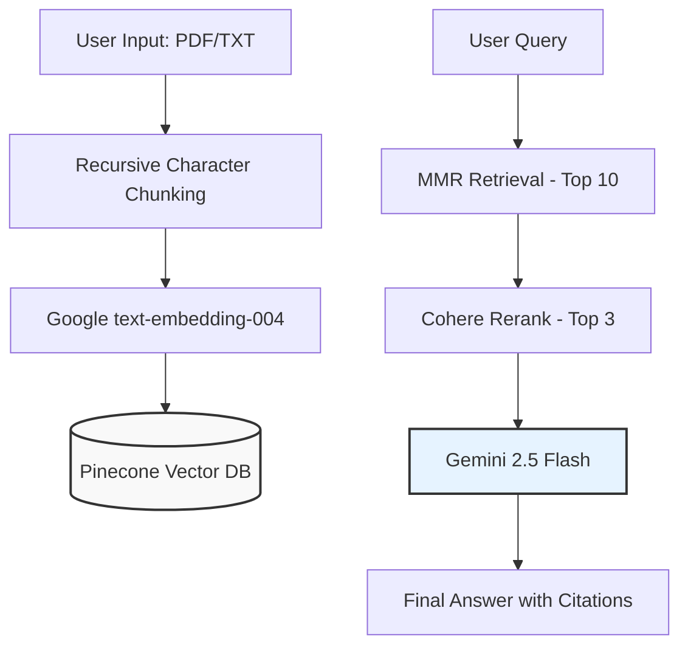

# Mini RAG

**Track B: AI Engineer Assessment**

**Author:** Niwesh Sah  
**Email:** sahniwesh@gmail.com  
**Affiliation:** Indian Institute of Technology, Mandi  
**Resume:** [View Resume](../resume.pdf)

---

## Project Overview

This repository contains a "Mini RAG" application built to demonstrate an end-to-end Retrieval-Augmented Generation pipeline. The system features hybrid retrieval, post-retrieval reranking, and grounded answer generation with inline citations. It allows users to upload PDF or text documents and query them using natural language.

You can check the working demo [here](https://mini-rag-predusk.streamlit.app/).

---


## Table of Contents

1. [Architecture & Query Flow](#architecture--query-flow)
2. [Index Configuration](#index-configuration)
3. [Setup & Installation](#setup--installation)
4. [Evaluation & Sample Data](#evaluation--sample-data)
5. [Remarks](#remarks)

---

## Architecture & Query Flow

The application follows a modular architecture separating data ingestion, vector storage, retrieval logic, and the frontend interface.

### System Architecture Diagram



### Module Breakdown

| Module | Responsibility |
| --- | --- |
| `config.py` | Centralized configuration and environment variable validation. |
| `utils.py` | Handles PDF parsing and recursive text chunking logic. |
| `vector_store.py` | Manages Pinecone connection, index creation, and embedding generation. |
| `rag_engine.py` | Orchestrates the RAG pipeline (Retrieval -> Reranking -> Generation). |
| `main_app.py` | The Streamlit frontend interface and session state management. |

---

## Index Configuration

To satisfy the **Track B** requirements, the vector database is configured as follows:

| Parameter | Configuration |
| --- | --- |
| **Vector Database** | Pinecone Serverless |
| **Cloud Provider** | AWS (`us-east-1`) |
| **Index Name** | `mini-rag-index` |
| **Dimensionality** | 768 (Optimized for `text-embedding-004`) |
| **Metric** | Cosine Similarity |
| **Namespace** | `niwesh-namespace` |

### Chunking Strategy

* **Algorithm:** `RecursiveCharacterTextSplitter`
* **Chunk Size:** 1000 characters
* **Chunk Overlap:** 100 characters (10%)
* **Metadata:** Includes source filename, chunk ID, and text preview for citation mapping.

---

## Setup & Installation

### 1. Dependencies

Ensure you have Python 3.10.0 installed. The key dependencies include:

* `streamlit`
* `langchain` (Core, Google GenAI, Pinecone, Cohere)
* `pinecone-client`
* `pypdf`
* `python-dotenv`

### 2. Environment Configuration

Create a `.env` file in the project root directory:

```bash
GOOGLE_API_KEY="your-google-api-key"
PINECONE_API_KEY="your-pinecone-api-key"
COHERE_API_KEY="your-cohere-api-key"

```

### 3. Installation & Execution

```bash
# Install requirements
pip install -r requirements.txt

# Run the application
streamlit run main_app.py

```

---


## Evaluation & Sample Data

The system was evaluated using the technical report: [Real-Time Spatial NMPC for Autonomous Drone Racing](./drone_racing_report.pdf).

Below is the **Gold Set** of Question/Answer pairs used to verify precision, recall, and safety guardrails.

| Query | Generated Answer | Evaluation Note |
| --- | --- | --- |
| **"What is the specific speedup achieved by the proposed method over the baseline in Level 1?"** | It achieves a speedup of 46% to 48%. | **Precision:** Correctly extracted specific statistical range. |
| **"Which quadrotor platform was used for the challenge setup?"** | The Crazyflie quadrotor. | **Precision:** Identified specific hardware entity. |
| **"What strategy was adopted for global path generation?"** | A cubic spline interpolation strategy using gate centers as waypoints. | **Recall:** Synthesized technical strategy details. |
| **"What is the success rate in Level 2 (Perturbed) conditions?"** | It maintains a success rate of 75%. | **Recall:** Correctly distinguished Level 2 data from Level 1. |
| **"What was the battery limit of the drone?"** | I cannot answer this based on the provided context. | **Safety:** Correctly triggered the "No Answer" guardrail. |

---

## Remarks

### Limitations

* **Gemini 2.5 Flash Free Tier:** The application is subject to Request Per Minute (RPM) limits, which may affect throughput during high-volume testing.
* **Pinecone Free Tier:** Restricted to a single index. To accommodate this, a "Clear Knowledge Base" feature was implemented to reset the namespace for new documents.

### Trade-offs

* **Model Selection:** Gemini 2.5 Flash was used as it has higher free limit and faster latency.

### Future Improvements

1. **Semantic Chunking:** Implementing semantic-aware chunking to better preserve the integrity of mathematical equations and structured tables found in technical reports.
2. **Hybrid Search:** Integrating Keyword (BM25) + Vector search to improve retrieval accuracy for domain-specific acronyms (e.g., "NMPC", "RRT").
3. **Conversation Memory:** Adding a long-term conversation memory buffer to support multi-turn reasoning and follow-up questions.

---